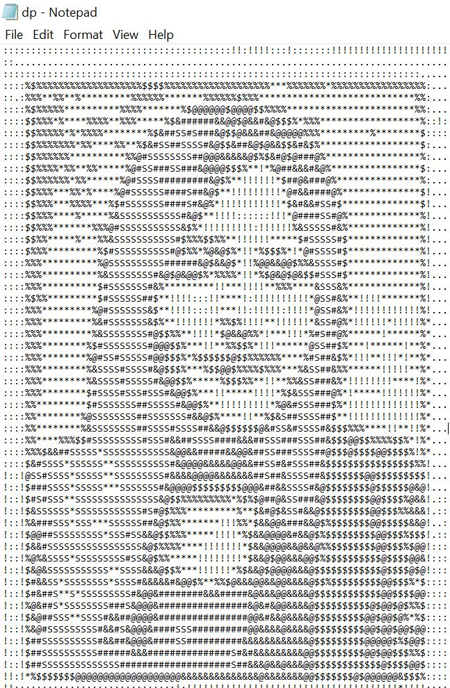

# ascii_image

**[Try the webapp](https://utpaldas6.github.io/ascii_image/)** — drop an image in, get ASCII art out, all in the browser.

Convert any image to ascii txt file using pywhatkit.
 
steps:
 
pip install pywhatkit
 
python pyscript.py

INPUT:
 

OUTPUT:
 

